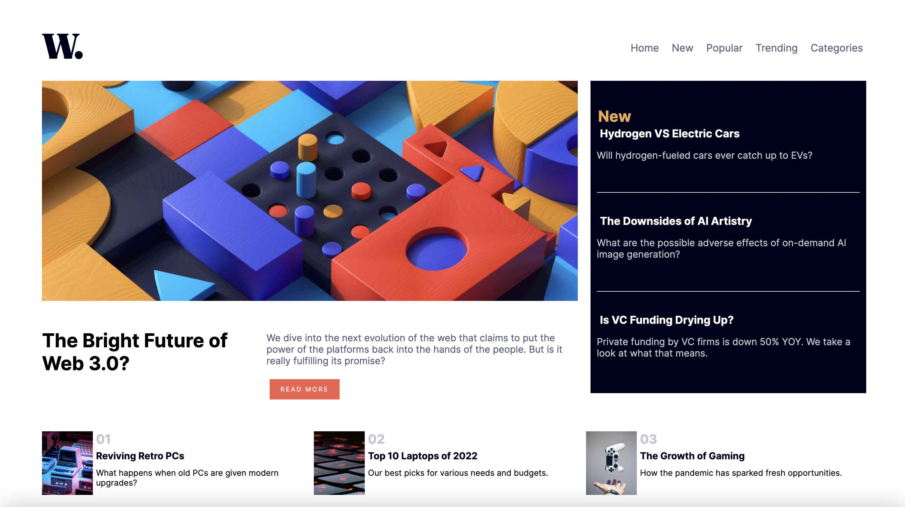
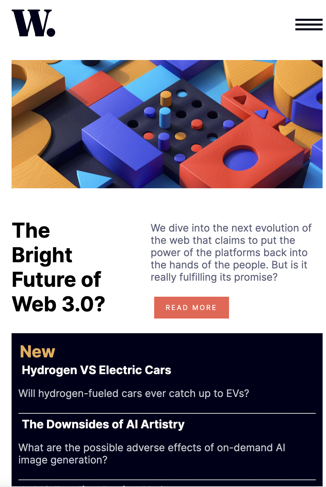

# Frontend Mentor - News homepage

## Welcome! 👋

Thanks for checking out this front-end coding challenge.

## The challenge
Users should be able to:

- View the optimal layout for the interface depending on their device's screen size
- See hover and focus states for all interactive elements on the page
- Toggle the mobile menu

## Screenshots

### Desktop view

### Mobile view

## Built with 
- HTML
- CSS
- JavaScript

## Links
[Live Version](https://nico-dev-it.github.io/newsHomePage/)